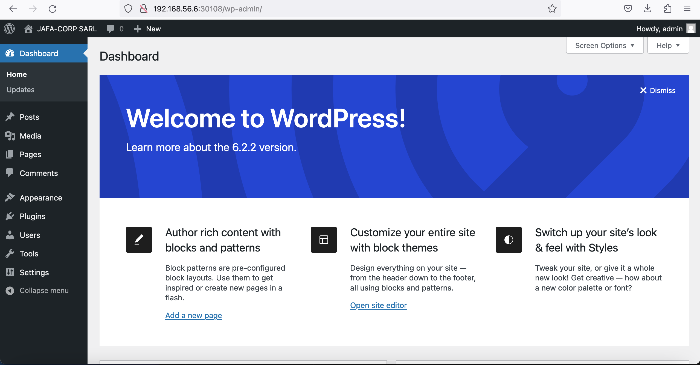

# Compte rendu de la réalisation du mini-projet kubernetes

L'objectif de ce mini-projet était de déployez wordpress en suivant les étapes suivantes:
> - Créez un déployment mysql avec un seul replicat ```mysql-deployment.yml```
> - Créez un service de type clusterIP pour exposer nos pods mysql ```mysql-clusterip-service.yml```
> - Créez un deployment wordpress avec les bonnes variables d'environnement pour se connecter à la base de données mysql ```wordpress-deployment.yml```
> - Créez un service de type nodeport pour exposer le frontend wordpress ```wordpress-nodeport-service.yml```

À la fin, on a notre interface frontend wordpress que nous pouvons configurer aisément:

  

Après avoir lu mes manifest, que pouvez-vous me conseiller pour optimiser ces tâches.