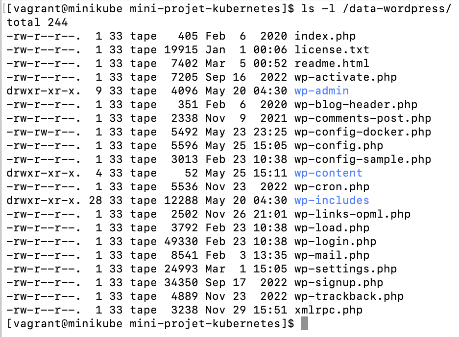

# Mini-Projet: Déploiement de Wordpress avec Kubernetes

L'objectif de ce mini-projet est de déployez wordpress en utilisant Kubernetes. Nous avons utilisé les objets de type déploiement, des services de type NodePort, ClusterIP et également des volumes pour créer une application WordPress fonctionnelle avec une base de données MySQL.

## Prérequis

> - Un cluster Kubernetes ou Minikube fonctionnel
> - Puis avoir un outil configuré pour se connecter au cluster à l'instar de ``kubectl``

Suivez les étapes ci-dessous pour déployer WordPress avec Kubernetes:

1. Créer un namespace (Optionnel pour ce mini-projet):
   > - Pour ce projet, nous avons utilisé le namespace par ``défaut``

2. Déploiement de MySQL:
   > - Utilisez le fichier (``mysql-deployment.yml``) pour déployer MySQL en exécutant la commande: ``kubectl apply -f mysql-deployment.yml``

3. Création d'un service pour MySQL:
   > - Utilisez le fichier (``mysql-clusterip-service.yml``) pour créer un service ClusterIP pour exposer les pods MySQL en exécutant la commande: ``kubectl apply -f mysql-clusterip-service.yml``

4. Déploiement de WordPress:
   > - Utilisez le fichier (``wordpress-deployment.yml``) pour déployer WordPress en exécutant la commande: ``kubectl apply -f wordpress-deployment.yml``

5. Création d'un service pour WordPress:
   > - Utilisez le fichier (``wordpress-nodeport-service.yml``) pour créer un service NodePort pour exposer le frontend de WordPress en exécutant la commande: ``kubectl apply -f wordpress-nodeport-service.yml``

6. Accédez à WordPress:
   > - Utilisez la commande ``hostname -I``pour obtenir l'adresse IP de votre cluster.
   > - Ouvrez votre navigateur web et accédez à l'adresse IP du cluster avec le nodePort spécifié pour le service WordPress dans le fichier ``wordpress-nodeport-service.yml``.

À la fin, on a notre interface frontend wordpress que nous pouvons configurer aisément:

  

## Gestion du Stockage

Le déploiement de WordPress utilise un volume monté pour stocker les données dans le répertoire ````/data-wordpress ````du nœud. Vous pouvez vérifier que le volume a bien été monté en exécutant la commande suivante :

```kubectl describe pod <nom_du_pod>```

Dans les détails du pod, vous devriez voir une section indiquant le mmontage du volume:
```
Volumes:
  wordpress-persistent-storage:
    Type:          HostPath (bare host directory volume)
    Path:          /data-wordpress
    HostPathType:  DirectoryOrCreate
````

On peut également vérifier la présence des fichiers essentiels à WordPress dans le répertoire ```/data-wordpress``` du noeud:

  

## Architecture du projet
> - ```mysql-deployment.yml``` : Fichier yaml pour le déploiement de l'objet de type deployment de MySQL;
> - ```mysql-clusterip-service.yml``` : Fichier yaml pour la création d'un service ClusterIP pour MySQL;
> - ```wordpress-deployment.yml``` : Fichier yaml pour le déploiement de WordPress;
> - ```wordpress-nodeport-service.yml``` : Fichier yaml pour la création d'un service NodePort pour exposer le frontend de WordPress.
